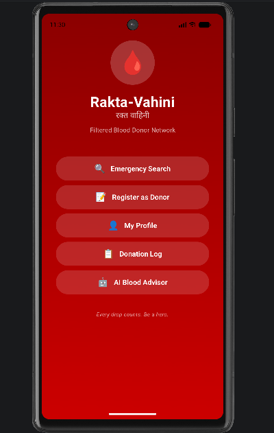
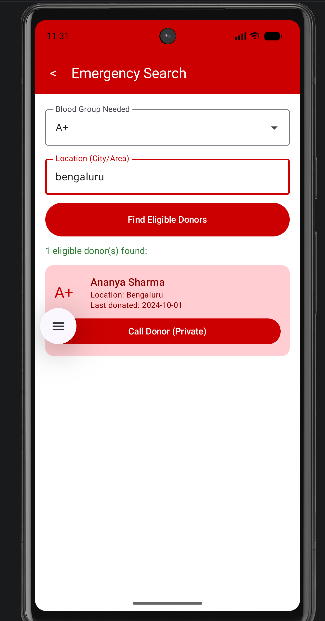
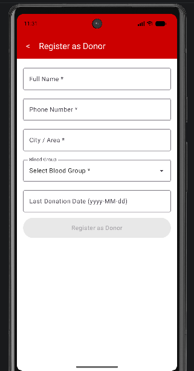
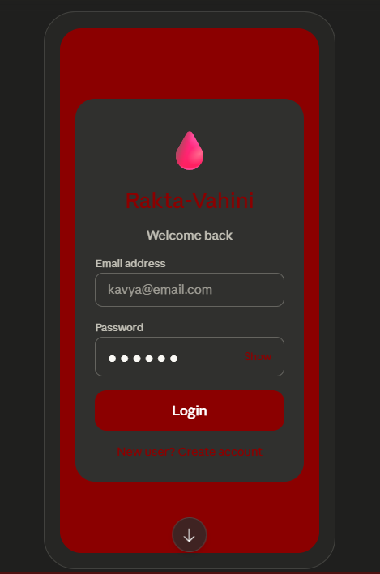

# 🩸 Rakta-Vahini — Filtered Blood Donor Network


> **"Every drop counts. Be a hero."**  
> A privacy-focused Android app that connects patients in rural hospitals with **currently eligible** blood donors nearby — filtering out the WhatsApp noise and showing only donors who can donate right now.

---

## 📱 App Screenshots

| Home | Emergency Search | Search Results |
|------|-----------------|----------------|
|  |  |  |

| Register | Donation Log | AI Advisor | Login |
|----------|--------------|------------|-------|
|  |  |  |  |


---

## 🚨 Problem Statement

When someone needs blood in a rural hospital, they depend on **"Mass Forwards"** on WhatsApp. These messages:
- Don't reach the **right blood group** in time
- Have **no filter** for donor current availability
- Show **no eligibility status** (the 90-day donation rule is ignored)

**Rakta-Vahini** solves this with a filtered, private, real-time donor directory.

---

## ✨ Features

| Screen | What it does |
|--------|-------------|
| 🏠 **Home** | Central dashboard with 5 navigation options |
| 🔍 **Emergency Search** | Filter by blood group + city/area — only eligible donors (90+ days) shown |
| 📋 **Register as Donor** | Full name, phone, city/area, blood group dropdown, last donation date |
| 👤 **My Profile** | View and manage your donor details |
| 📝 **Donation Log** | Log each donation with hospital/location + view full history |
| 🤖 **AI Blood Advisor** | Chat-based advisor — blood types, eligibility, health tips |
| 🔒 **Privacy Calling** | "Call Donor (Private)" — phone number never shown on screen |
| 🔑 **Login / Auth** | Email & password login with "New user? Create account" |

---

## 📸 UI Highlights

- **Deep red theme** throughout — professional, urgent, life-saving
- **Hindi subtitle** "रक्त वाहिनी" displayed on the home screen
- **AI Advisor quick chips:** *"Am I eligible to donate?"* · *"What is O- blood group?"* · *"Side effects of donation?"* · *"Can diabetics donate?"*
- **Donor cards** show: blood group badge · name · location · last donation date — **phone number is never shown**
- **Donation history** stored with date + hospital (e.g. *2026-05-11 · St. Marry's Hospital, Bengaluru*)
- **Eligibility auto-computed:** donors who last donated > 90 days ago appear in search; others are hidden entirely

---

## 🛠️ Tech Stack

| Layer | Technology |
|-------|-----------|
| **Language** | Kotlin |
| **UI** | Jetpack Compose + Material 3 |
| **Navigation** | Jetpack Navigation Compose |
| **Backend** | Firebase Firestore |
| **Authentication** | Firebase Auth (Email / Password) |
| **AI Advisor** | Claude AI via OkHttp API calls |
| **Networking** | OkHttp + Gson |
| **Local Storage** | DataStore Preferences |
| **Min SDK** | API 24 — Android 7.0 |
| **Target SDK** | API 36 |

---

## 🏗️ Project Structure

```
app/src/main/java/com/yourname/raktavahini/
│
├── MainActivity.kt                  # Compose entry point
│
├── data/
│   ├── Models.kt                    # Donor, DonationRecord data classes
│   ├── DonorRepository.kt           # Local data & eligibility logic
│   ├── FirebaseRepository.kt        # Firestore CRUD operations
│   └── ClaudeAiService.kt           # AI Advisor — Claude API integration
│
└── ui/
    ├── AppNavigation.kt             # Navigation graph (all routes)
    ├── theme/
    │   ├── Color.kt                 # Red theme palette
    │   ├── Theme.kt
    │   └── Type.kt
    └── screens/
        ├── HomeScreen.kt            # 🏠 Main dashboard
        ├── LoginScreen.kt           # 🔑 Email/password auth
        ├── RegisterScreen.kt        # 📋 Donor registration form
        ├── SearchScreen.kt          # 🔍 Emergency blood search ⭐
        ├── ProfileScreen.kt         # 👤 Donor profile
        ├── DonationLogScreen.kt     # 📝 Log & history
        ├── StatsScreen.kt           # 📊 Impact statistics
        ├── AiAdvisorScreen.kt       # 🤖 AI chat advisor
        └── BloodRequestScreen.kt    # 🆘 Request blood for someone
```

---

## ⚙️ Setup & Installation

### Prerequisites
- Android Studio Hedgehog or newer
- JDK 11+
- A Firebase project
- Git installed

### 1. Clone the Repository
```bash
git clone https://github.com/kvya6/RaktaVahini.git
cd RaktaVahini
```

### 2. Firebase Setup
1. Go to [Firebase Console](https://console.firebase.google.com)
2. Create a project named **RaktaVahini**
3. Add an Android app with package name: `com.yourname.raktavahini`
4. Download `google-services.json` → place it inside the `app/` folder
5. Enable **Email/Password Authentication** → Authentication → Sign-in method
6. Enable **Firestore Database** → Start in test mode

### 3. Run the App
Open in Android Studio and click **▶ Run**, or from terminal:
```bash
./gradlew assembleDebug
```

---

## 🔥 Firestore Data Structure

```
/donors/{userId}
  ├── name: "Ananya Sharma"
  ├── phone: "9876543210"      ← stored privately, NEVER shown in UI
  ├── bloodGroup: "A+"
  ├── city: "Bengaluru"
  └── lastDonationDate: "2024-10-01"

/donations/{donationId}
  ├── userId: String
  ├── date: "2026-05-11"
  ├── location: "St. Marry's Hospital Bengaluru"
  └── note: String (optional)
```

---

## 📐 Core Eligibility Logic

```kotlin
// A donor is eligible only if 90+ days have passed since last donation
fun isEligible(lastDonationDate: String): Boolean {
    val formatter = DateTimeFormatter.ofPattern("yyyy-MM-dd")
    val last = LocalDate.parse(lastDonationDate, formatter)
    val daysSince = ChronoUnit.DAYS.between(last, LocalDate.now())
    return daysSince >= 90
}
```

> ✅ Ineligible donors are **completely hidden** from search results — not grayed out, not shown at all.

---

## 🔒 Privacy & Security

- Phone numbers are stored in Firestore but **never rendered** in any UI text field
- **"Call Donor (Private)"** uses `Intent.ACTION_DIAL` — only the Android phone dialer sees the number, not our app
- Firebase Auth tokens secure all Firestore reads and writes
- Eligibility is computed and filtered **before** results are displayed

---

## 🎯 Project Success Criteria (Title 07)

| Criterion | Status |
|-----------|--------|
| Search hides ineligible donors (< 90 days) | ✅ |
| Thank You notification after donation is logged | ✅ |
| Professional, life-saving focused UI | ✅ |
| Privacy-safe calling — number never shown publicly | ✅ |
| Eligibility = Current Date − Last Donation Date ≥ 90 days | ✅ |
| AI Advisor for blood donation queries | ✅ |

---

## 🤝 Contributing

```bash
# Fork → Clone → Create branch → Commit → Push → Pull Request
git checkout -b feature/your-feature-name
git commit -m "Add: your feature description"
git push origin feature/your-feature-name
```

---

## 📄 License

MIT License — free to use, modify, and distribute with attribution.

---

## 👩‍💻 Author

**Kavya** — [@kvya6](https://github.com/kvya6)

> Built as part of **Android App Development using GenAI — Project Title 07**  
> *Rakta-Vahini: A filtered blood donor network for rural healthcare, powered by Kotlin, Firebase & AI.*

---

<div align="center">
  <br/>
  <strong>🩸 Every donation saves up to 3 lives.</strong>
  <br/>
  <strong>Every line of code here helps make that happen faster.</strong>
  <br/><br/>
  <em>"Every drop counts. Be a hero."</em>
</div>
